# _Mentcare Demo_
*Alessandro Marconcini VR489524, Gabriele Nicolosi VR488110 , Emanuel Cirabisi VR472646
A.A. 2022/2023
Università degli Studi di Verona.*

# Indice

# 1 - Introduzione

Mentcare è un sistema informativo utile per la gestione di cliniche che trattano pazienti con problemi di salute mentale.
Esso dovrà fornire un insieme di metodi e strumenti necessari per la raccolta, conservazione e utilizzo dei dati
utili a una o più cliniche responsabili di pazienti mentalmente instabili che non necessitano di ospedalizzazione.
I pazienti trattati sono dunque presi in cura da cliniche specializzate che hanno un personale formato da receptionist 
che gestiranno gli appuntamenti e le visite per conto dei pazienti, da medici che supervisionano lo stato clinico
dei pazienti, effettueranno visite su appuntamento e prescriveranno le cure adeguate e da infermieri che avranno cura
di somministrare le cure ai pazienti in visita nella struttura. Inoltre la figura del manager supervisionerà la clinica
e gli utenti che ne fanno parte, avrà inoltre il compito di inserire i nuovi utenti nel sistema.
Lo scopo di Mantecare è informatizzare il processo di gestione e cura del paziente mentalmente instabile nell'ambito
clinico.

# 2 - Background e processo di sviluppo software

In questo progetto è stata adottata la metodologia **Agile** per conseguire uno sviluppo di tipo incrementale, flessibile e adatto
alle continue modifiche in fase di progettazione. In particolare, fin dall'inizio il team ha cercato di mantenere la semplicità
così da poter semplificare le successive modifiche.
Il processo ha avuto inizio con la creazione dei primi scenari da cui è stato possibile estrarre i requisiti di
sistema. Successivamente, una volta scelto il design architetturale (MVC), il team ha proseguito lo sviluppo lavorando
per step successivi a ogni singolo scenario suddividendolo in task così da poter parallelizzare il lavoro.
In questa fase, tramite un dettagliato confronto, il team si è reso conto che alcuni requisiti non erano stati definiti
correttamente e a tal proposito è stato molto utile l'approccio Agile che ci ha permesso di effettuare delle modifiche
agli scenari e ai rispettivi requisiti favorendo la realizzazione di un progetto completo. Parallelamente all'attività
sono stati condotti i test di unità per verificare la correttezza delle micro funzionalità implementate.
Si è cercato di monitorare lo stato di avanzamento del progetto a ogni step tramite un approccio "button-oriented" tramite
il quale l'implementazione di ogni singola funzionalità è stata immediatamente verificata eseguendo l'applicazione
e verificando la relativa interfaccia.
Una volta che il team non ha riscontrato problemi di alcun tipo con l'interfaccia grafica della nostra
applicazione, è iniziata la fase di testing in cui, tramite dei test in PageObject il team ha potuto
verificare la corretta esecuzione dell'interfaccia e dei rispettivi bottoni tramite diverse asserzioni.
Al termine dello sviluppo e della fase di testing sono state applicate operazioni refactoring migliorando la leggibilità
e comprensione del codice, questa fase è stata seguita da ripetute esecuzioni delle batterie di test al fine di verificare 
la correttezza delle operazioni di miglioramento del codice e l'immutate del comportamento del sistema.

# 3 - Analisi dei requisiti

## 3.1 - Specifica dei Requisiti

### 3.1.1 - Scenari

#### S1 - Il medico effettua una nuova prescrizione 

**Assunzione iniziale**: Il medico effettua una prescrizione per uno o più pazienti da lui in cura; il medico effettua
il login nel sistema inserendo il proprio codice ID e la password di sicurezza, viene visualizzata la schermata 
principale "Home Doctor".

**Funzionalità normale**: il medico, una volta effettuato il login, clicca sul bottone "Nuova Prescrizione" e viene reindirizzato alla
pagina "Nuova Prescrizione Medica". La nuova pagina presenta un form di compilazione per la nuova prescrizione medica.
Il medico può inserire un massimo di tre farmaci per ogni nuova prescrizione. Allora vengono compilati i campi di: 

- "Codice paziente", in cui il medico inserisce l'id del paziente a cui sta prescrivendo il farmaco;
- "Farmaco", in cui grazie a un menù a tendina vengono visualizzati i farmaci da poter prescrivere e presenti nel deposito farmaci della clinica;
- "Dosaggio", in cui deve essere inserita la dose in mg del farmaco prescritto;
- "Frequenza", in cui viene indicata la periodicità di assunzione farmaco;

Il medico dovrà inoltre aggiungere le sue indicazione di assunzione, o motivazioni, o eventuali note, nel "Report Medico".
Quando la prescrizione sarà stata compilata il medico clicca sul bottone "Salva Prescrizione" e visualizza la sua
schermata home "Home Doctor".

**Funzionalità impreviste**:
- Il paziente per cui il medico vuole effettuare la prescrizione non è presente nel sistema, viene allora visualizzata una
schermata di errore con le relative indicazioni;
- Il medico tenta di effettuare una prescrizione per un paziente non in cura da lui, viene allora visualizzata una
  schermata di errore;
- Il medico decide di non effettuare più la prescrizione, così cliccando sul pulsante "Indietro" l'operazione di
  prescrizione viene annullata e viene reindirizzato alla schermata home principale;
- Il dosaggio non rientra nel range di sicurezza e il sistema genera una notifica di errore chiedendo d'inserire il valore atteso.

**Altre attività**:
- Il medico cerca un appuntamento o le informazioni relative a un paziente da lui in cura, allora tramite l'apposita barra di ricerca nella sua "Home Doctor"
inserisce il cognome del paziente da ricercare.

**Stato di completamento**: La nuova prescrizione è stata completata ed è visibile dal medico, dal paziente e dagli infermieri.

#### S2 - Il medico visualizza la prescrizione di un paziente 

**Assunzione iniziale**: il medico visualizza la prescrizione medica di un paziente da lui in cura; il medico effettua
il login nel sistema inserendo il proprio codice ID e la password di sicurezza, viene visualizzata la schermata
principale "Home Doctor".

**Funzionalità normale**: il medico, una volta effettuato il login, visualizza nella sua schermata principale l’elenco di tutti i pazienti
da lui in cura e i relativi dati anagrafici, codici identificativi e i dati dell’appuntamento. Il medico clicca sulla
riga del paziente di cui intende visualizzare la prescrizione medica. Una volta effettuato il click la riga selezionata 
cambia di colore, allora il medico clicca sul bottone “Visualizza Prescrizione”. Il medico viene reindirizzato a 
una nuova pagina in cui viene visualizzata la prescrizione medica del paziente con i seguenti capi:
- Un campo di testo con le indicazioni del medico sull’assunzione farmaci o note sul paziente.
- Una lista di farmaci con le informazioni di:
  - Nome farmaco,
  - Dose Minima,
  - Dose Massima,
  - Dose Assegnata,
  - Frequenza di Dosaggio.

**Funzionalità impreviste**:
- Il paziente non ha nessuna prescrizione medica, viene allora visualizzata una prescrizione vuota.

**Altre attività**:
- Il medico, una volta visualizzata la prescrizione vuole ritornare alla sua home page, allora il medico clicca
  sul tasto indietro e viene reindirizzato alla “Home Doctor”.
- Il medico cerca un appuntamento o le informazioni relative a un paziente da lui in cura, allora tramite l'apposita barra di ricerca nella sua "Home Doctor"
  inserisce il cognome del paziente da ricercare.
- 
#### S3 - Un paziente visualizza la propria prescrizione medica 

**Assunzione iniziale**: Il paziente effettua il login nel sistema inserendo il proprio codice ID e la password di sicurezza, 
viene visualizzata la schermata principale "Home Patient".

**Funzionalità normale**: Il paziente una volta effettuato il login visualizza nella sua schermata principale l'elenco di tutti i suoi
appuntamenti presso la clinica. Il paziente clicca sul bottone "Visualizza Prescrizione Medica" collocato nella riga
del relativo appuntamento. Una volta effettuato il click il paziente visualizzerà la pagina "Prescrizione Medica Paziente"
in cui viene visualizzata la prescrizione medica del paziente con i seguenti capi:
- Un campo di testo con le indicazioni del medico sull’assunzione farmaci o note sul paziente.
- Una lista di farmaci con le informazioni di:
  - Nome farmaco,
  - Dose Minima,
  - Dose Massima,
  - Dose Assegnata,
  - Frequenza di Dosaggio.

**Funzionalità impreviste**:
- Il paziente non possiede una prescrizione medica, una volta effettuato il click sul bottone "Visualizza Prescrizione Medica"
viene allora visualizzata una schermata di errore con le relative indicazioni.

**Stato di completamento**: Il paziente ha visualizzato la sua prescrizione medica, allora clicca il bottone
"Indietro" e visualizza la schermata "Home Patient".

#### S4 - Un infermiere deve somministrare un farmaco a un paziente 

**Assunzione iniziale**: L'infermiere incaricato a somministrare dei farmaci al paziente effettua il login inserendo 
il proprio codice identificativo e la propria password, viene visualizzata la schermata principale "Home Nurse".

**Funzionalità normale**: L'infermiere, una volta effettuato il login, visualizza nella sua schermata principale l’elenco di tutti i pazienti
giornalieri che devono essere sottoposti a somministrazioni farmaci e i relativi dati anagrafici, codice identificativo
e i dati dell’appuntamento. L'infermiere clicca sul bottone "Visualizza" nel campo "Prescrizione Medica" posto a destra 
della riga contenente i dati del paziente. Una volta effettuato il click l'infermiere visualizza la pagina "Prescrizione 
Medica del Paziente". Nella pagina l'infermiere visualizza le seguenti indicazioni:
- Un campo di testo con le indicazioni del medico sull’assunzione farmaci o note sul paziente.
- Una lista di farmaci con le informazioni di:
  - Nome farmaco,
  - Dose Minima,
  - Dose Massima,
  - Dose Assegnata,
  - Frequenza di Dosaggio.

**Funzionalità impreviste**:
- Il paziente non è il elenco, deve allora essere effettuata la registrazione del paziente.
- Il paziente non possiede nessuna prescrizione medica, viene allora visualizzata una schermata di errore con relative indicazioni.
- L'infermiere, tramite la barra di ricerca situata nella propria homepage, digita il cognome del paziente a lui associato per visualizzare
  il relativo appuntamento; viene aggiornata la lista degli appuntamenti con le informazioni relative a quel paziente.

**Altre attività**:
- L'infermiere, al fine di effettuare la somministrazione farmaci al paziente, ricerca il paziente nell'elenco degli
appuntamenti facendo uso della barra di ricerca collocata in "Home Nurse", allora l'infermiere digita il cognome del
paziente interessato ed effettua la ricerca.

**Stato di completamento**: L'infermiere ha effettuato la somministrazione dei farmaci al paziente, allora clicca il bottone
"Indietro" e visualizza la schermata "Home Nurse".

#### S5 - Il receptionist crea un nuovo appuntamento 

**Assunzione iniziale**: Il receptionist effettua il login inserendo il codice identificativo e la propria password,
viene visualizzata la schermata principale "Home Receptionist".

**Funzionalità normale**: Il receptionist, una volta effettuato il login, visualizza l'elenco di tutti gli appuntamenti dei pazienti
della clinica. Allora, inserisce un nuovo appuntamento cliccando sul bottone "Crea Appuntamento" posto nella parte
superiore della home page. Una volta effettuato il click compare la schermata "Inserimento Appuntamenti" all'interno
della quale il receptionist inserisce l'id, il nome, il cognome del paziente; cliccando sul menù a tendina posto nella
voce "Medico" il receptionist visualizza una lista di tutti i medici della clinica e selezione il medico che dovrà
effettuare la visita, tramite un altro menù a tendina seleziona l'infermiere incaricato alla somministrazione farmaci al
paziente, poi clicca sul campo "Data" e tramite un calendario seleziona la data dell'appuntamento. Infine
inserisce l'ora dell'appuntamento. Una volta che tutti i campi sono stati compilati il receptionist clicca sul bottone
"Registra appuntamento".

**Funzionalità impreviste**:
-  Il receptionist inserisce l'id errato, allora viene visualizzata una schermata di errore;
-  Il receptionist non compila uno dei campi, allora viene visualizzata una schermata di errore;

**Altre attività**:
- Il receptionist decide di non registrare più l'appuntamento del paziente, allora clicca il pulsate "Indietro" e 
visualizza la schermata "Home Receptionist";
- Il receptionist, vuole verificare la presenza di un appuntamento di un paziente, ricerca il paziente nell'elenco degli
  appuntamenti facendo uso della barra di ricerca collocata in "Home Receptionist", allora il receptionist digita il cognome del
  paziente interessato ed effettua la ricerca.

**Stato di completamento**:
Il receptionist ha effettuato l'operazione di registrazione dell'appuntamento, l'appuntamento è allora visibile nella
schermata "Home Receptionist" e nell'elenco degli appuntamenti del medico con il quale l'appuntamento è stato fissato e
dell'infermiere che somministrerà i farmaci.

#### S6 - Il receptionist modifica un appuntamento

**Assunzione iniziale**: Il receptionist effettua il login inserendo il codice identificativo e la propria password
e viene visualizzata la schermata principale "Home Receptionist".

**Funzionalità normale**: Il receptionist, una volta effettuato il login, visualizza l'elenco di tutti gli appuntamenti dei pazienti
della clinica. Allora, modifica un appuntamento precedentemente creato cliccando prima sull'appuntamento da modificare
e poi sul bottone "Modifica" posto in corrispondenza dell'appuntamento stesso.
Una volta effettuato il click compare la schermata "Modifica Appuntamento" all'interno della quale il receptionist inserisce l'id,
il nome, il cognome del paziente; cliccando sul menù a tendina posto nella voce "Medico" il receptionist visualizza una lista di tutti
i medici della clinica e selezione il medico che dovrà effettuare la visita, tramite un altro menù a tendina seleziona l'infermiere incaricato alla somministrazione farmaci al
paziente, l'infermiere poi clicca sul campo "Data" e tramite un calendario seleziona la data dell'appuntamento, infine
inserisce l'ora dell'appuntamento. Una volta che tutti i campi sono stati compilati il receptionist clicca sul bottone
"Conferma modifica".

**Funzionalità impreviste**:
-  Il receptionist vuole cambiare il medico associato al paziente ma questo non è presente nel sistema; deve allora essere effettuata
   la registrazione del medico dal manager.

**Altre attività**:
- Il receptionist decide di non modificare più l'appuntamento del paziente, allora clicca il pulsate "Indietro" e
  visualizza la schermata "Home Receptionist".

**Stato di completamento**:
Il receptionist ha effettuato l'operazione di modifica dell'appuntamento, l'appuntamento è allora stato aggiornato nella
schermata "Home Receptionist" e nell'elenco degli appuntamenti del medico con il quale l'appuntamento è stato fissato e
dell'infermiere che somministrerà i farmaci.

#### S7: Il receptionist cancella un appuntamento

**Assunzione iniziale**: Il receptionist effettua il login inserendo il codice identificativo e la propria password
e viene visualizzata la schermata principale "Home Receptionist".

**Funzionalità normale**: Il receptionist, una volta effettuato il login, visualizza l'elenco di tutti gli appuntamenti dei pazienti
della clinica. Allora, cancella un appuntamento presente nel sistema cliccando prima sull'appuntamento
e poi sul bottone "Cancella" posto in corrispondenza dell'appuntamento stesso.

**Funzionalità impreviste**:
-  Il receptionist vuole cancellare un preciso appuntamento, ma questo non è presente nella lista degli appuntamenti.

**Altre attività**:
- Il receptionist, tramite la barra di ricerca situata nella propria homepage, digita il cognome del paziente
a lui associato per visualizzare il relativo appuntamento; viene aggiornata la lista degli appuntamenti con le
informazioni relative a quel paziente.

**Stato di completamento**:
Il receptionist ha effettuato l'operazione di cancellazione dell'appuntamento. L'appuntamento non è più presente nella
schermata "Home Receptionist", nell'elenco degli appuntamenti del medico con il quale l'appuntamento era stato fissato e
nell'elenco dell'infermiere che doveva effettuare la somministrazione dei farmaci.

#### S8: Il manager inserisce un nuovo utente nel sistema

**Assunzione iniziale**: Il manager effettua il login inserendo il codice identificativo e la propria password
e viene visualizzata la schermata principale "Home Manager".

**Funzionalità normale**: Il manager, una volta effettuato il login, visualizza l'elenco di tutti gli utenti registrati
nella clinica. Tramite l'apposito panel collocato nella sezione superiore della pagina il manager ha la possibilità di
scegliere tra i seguenti bottoni:

- "Nuovo Medico",
- "Nuovo Infermiere";
- "Nuovo Paziente";
- "Nuovo Receptionist";

Al manager gli viene commissionato il compito di registrare un nuovo medico, perciò clicca sul bottone "Nuovo Medico"
e viene reindirizzato alla pagina "Registrazione Medico" in cui inserisce i campi: nome, cognome, password, data di nascita,
luogo di nascita, codice fiscale, specializzazione medica e telefono.
Una volta che tutti i campi dell'utente da registrare sono stati compilati il manager clicca sul bottone "Registra".

**Funzionalità impreviste**:
-  Il manager non compila uno dei campi, allora viene visualizzata una schermata di errore;

**Altre attività**:
- Il manager decide di annullare la registrazione dell'utente, allora clicca il pulsate "Indietro" e
  visualizza la schermata "Home Manager";
- Il manager registra un nuovo infermiere, allora clicca sul bottone "Nuovo Infermiere" ed è reindirizzato alla pagina 
"Registrazione Infermiere" in cui inserirà i campi: nome, cognome, password, data di nascita, luogo di nascita,
codice fiscale;
- Il manager registra un nuovo Paziente, allora clicca sul bottone "Nuovo Paziente"ed è reindirizzato alla pagina
"Registrazione Paziente" in cui inserirà i campi: nome, cognome, password, data di nascita, luogo di nascita,
codice fiscale, patologia riscontrata, e spunterà la casella "Si" o "No" per indicare se il paziente è pericoloso;
- Il manager registra un nuovo Receptionist, allora clicca sul bottone "Nuovo Receptionist" ed è reindirizzato alla
pagina "Registrazione Receptionist" in cui inserirà i campi: nome, cognome, password, data di nascita, luogo di nascita, codice fiscale;

**Stato di completamento**:
Il manager ha effettuato l'operazione di registrazione del medico e questo è visibile all'interno dell'elenco degli
utenti registrati in "Home Manager" e all'interno del sistema.

#### S9: Il manager ricerca un utente nel sistema (medico, paziente, infermiere, receptionist)

**Assunzione iniziale**: Il manager effettua il login inserendo il codice identificativo e la propria password
e viene visualizzata la schermata principale "Home Manager".

**Funzionalità normale**: Il manager, una volta effettuato il login, visualizza l'elenco di tutti gli utenti registrati
nella clinica. Allora, decide di cercare un utente già presente all'interno del sistema utilizzando l'apposita barra di ricerca
nella homepage. Una volta effettuato il click sulla barra di ricerca, inserisce il cognome dell'utente desiderato e
sempre nella stessa pagina compare la lista aggiornata con l'utente desiderato che corrisponde al cognome inserito.

**Funzionalità impreviste**:
-  Il manager inserisce nella barra di ricerca in maniera errata il cognome dell'utente e nella pagina comparirà una lista vuota o un altro
   utente non desiderato; allora cancella il cognome errato dalla barra di ricerca;
-  Il manager inserisce nella barra di ricerca il cognome di un utente non ancora registrato nel sistema e
   nella lista degli utenti non comparirà; allora registra l'utente nel sistema.

**Altre attività**:
- Il manager decide di non cercare più l'utente nella lista, così cancella quanto digitato nella barra di ricerca.

**Stato di completamento**:
Il manager ha effettuato l'operazione di ricerca dell'utente e viene aggiornata la lista degli utenti nella schermata
principale con una nuova lista contenete gli utenti con il cognome ricercato.

## 3.1.2 - Stakeholder

Gli attori del sistema:

- Pazienti
- Dottori
- Infermieri
- Receptionist
- Manager

### 3.1.3 - Requisiti funzionali per attori
Di seguito i requisiti funzionali per gli attori del sistema estrapolati dagli scenari. Per ogni requisito è indicato
il corrispettivo scenario.

(a) Medici

- (a.1) Un medico può prescrivere farmaci a ogni paziente da lui in cura (S1)
- (a.2) Un medico può visualizzare la prescrizione clinica del paziente (S2)
- (a.3) Un medico può inserire delle indicazioni o delle note sul paziente o i farmaci prescritti (S1)
- (a.3) Un medico può visualizzare la lista di farmaci somministrati da ogni paziente da lui in cura (S2)
- (a.4) Un medico può visualizzare la lista dei propri appuntamenti (S1)
- (a.5) Un medico può ricercare l'appuntamento con un determinato paziente inserendo il relativo cognome (S1) 
- (a.6) Il medico può inserire un massimo di tre farmaci per ogni nuova prescrizione (S1)

(b) Infermieri

- (b.1) Un infermiere può visualizzare la lista dei propri appuntamenti nella propria homepage (S4)
- (b.2) Un infermiere ha la possibilità di ricercare un paziente per ottenere le sue informazioni tramite il cognome del paziente(S4)
- (b.3) Un infermiere può visualizzare la lista di farmaci prescritti a ogni paziente (S4)

(c) Pazienti

- (c.1) Un paziente può visualizzare la lista dei propri appuntamenti (S3)
- (c.2) Un paziente può visualizzare la propria prescrizione medica (S3)
- (c.3) Un paziente può visualizzare le dosi che deve assumere per ogni farmaco (S3)

(d) Receptionist

- (d.1) Un receptionist può registrare gli appuntamenti di un utente (S5)
- (d.2) Un receptionist può ricercare l'appuntamento di un paziente inserendo il cognome del paziente (S5/S7)
- (d.2) Un receptionist può modificare gli appuntamenti di un utente (S6)
- (d.3) Un receptionist può cancellare gli appuntamenti di un utente (S7)

(e) Manager

- (e.1) Un manager può registrare un nuovo utente (S8)
- (e.2) Un manager può visualizzare la lista degli utenti registrati nel sistema (S8)
- (e.3) Un manager può effettuare la ricerca di un utente per verificarne l'esistenza nel sistema (S9)   

### 3.1.4 Requisiti non funzionali di sicurezza e safety

- Il sistema garantisce la protezione dei dati e la privacy dei pazienti rendendo i loro dati
personali visibili solamente ai medici e infermieri che li hanno in cura;
- Il sistema effettua un controllo sulle dosi dei farmaci basandosi su un range di sicurezza. In caso di errore sarà visualizzata 
una schermata di errore e la dose deve essere reinserita;
- Il sistema per ogni nuovo utente generato crea un codice ID univoco;
- Il sistema consente l'accesso all'area riservata sulla base dell'utente autenticato.

# 4 - Design architetturale

L'organizzazione di base del sistema software Mentcare, espressa dai suoi componenti, dalle relazioni tra di loro
e con l'ambiente, è stata realizzata facendo utilizzo del pattern architetturale Model View Controller (MVC).
Il modello MVC ha permesso di poter soddisfare le esigenze di sviluppo software in quanto:
- ha permesso di modificare indipendentemente dai dati del sistema a rappresentazione grafica degli stessi;
- ha supportato il cambiamento dei dati in maniera consistente rendendo un cambiamento in un componente
visibile a tutti gli altri componenti, essenziale per la tipologia di processo di sviluppo software agile scelta;
- ha permesso lo sviluppo, il test e la manutenzione di ciascuna parte indipendentemente dall'altra.

## 4.1 - Componenti del Model View Controller 

**Model**: tutti gli attori del sistema sono stati rappresentati per mezzo di entità model:

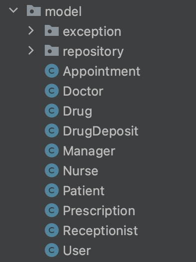

**View**: l'interazione con gli utenti e la visualizzazione dei dati inerenti gli utenti sono stati gestiti e visualizzati
per mezzo delle entità view:

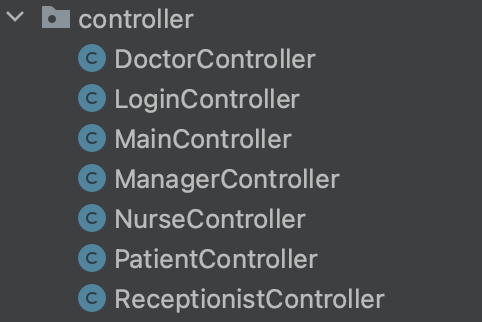

**Controller**: le operazioni ricezioni comandi e svolgimento operazioni sono state effettuate per mezzo delle 
entità controller:

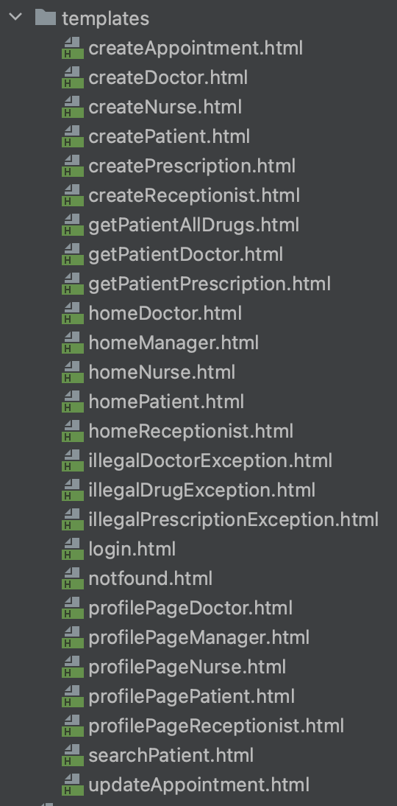

## 4.2 - Class Diagram

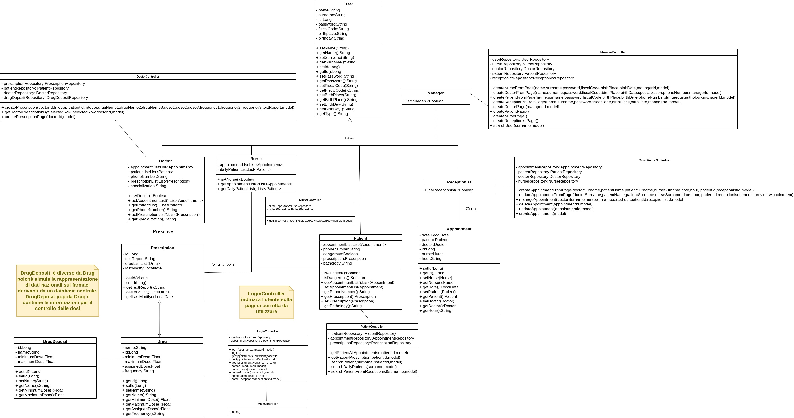

## 4.3 - Interfaccia grafica

**Login utente**

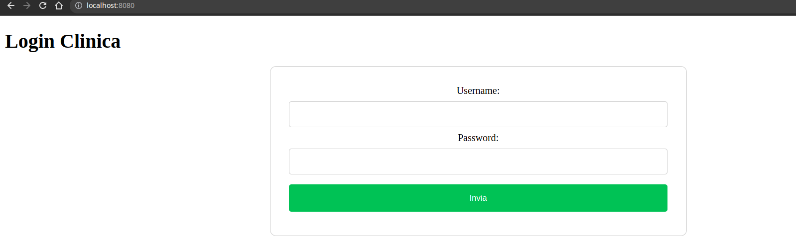

**Home Manager**

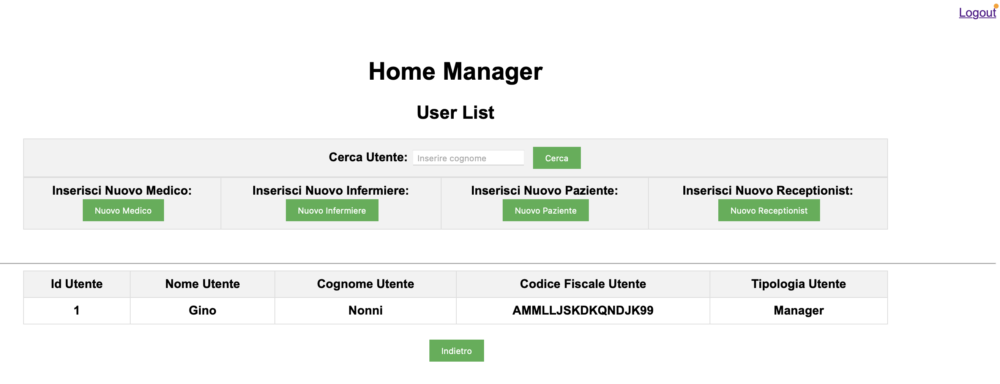

**Home Doctor**

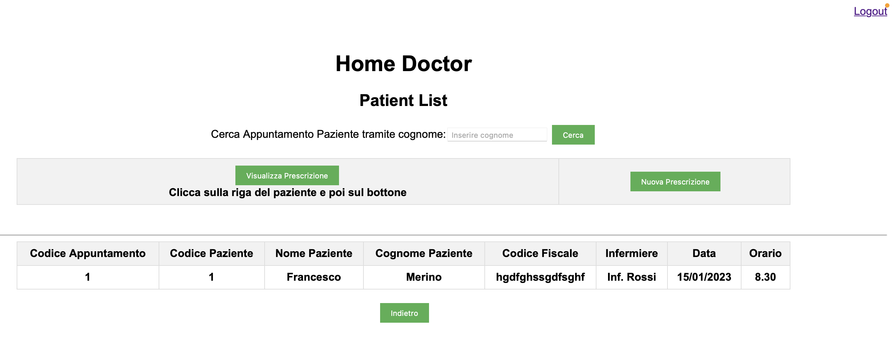

**Home Receptionist**

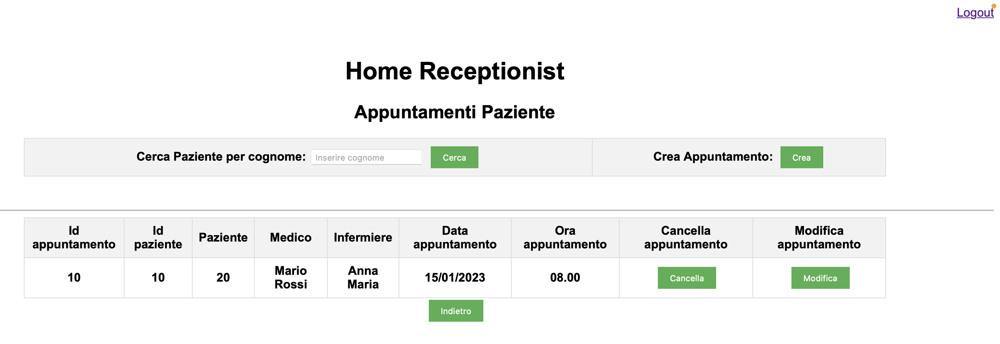

**Home Nurse**

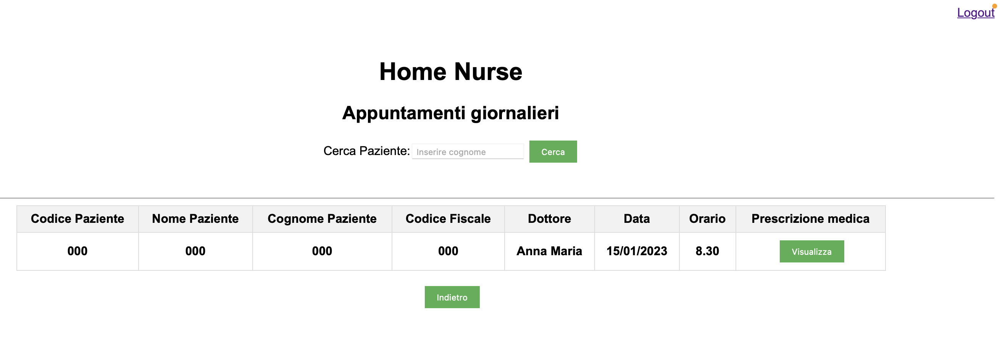

**Home Patient**

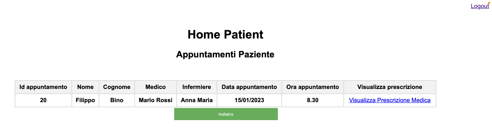

# 5 - Implementazione e Testing di unità

## 5.3 - Testing di unità
Lo sviluppo del sistema software è stato validato facendo utilizzo di test di unità eseguiti per mezzo di JUnit,
i test di unità sono stati eseguiti sulle singole entità model che compongono il sistema, sono stati testati
i singoli metodi, le singole funzionalità per ogni model.

#### UserTest
Test di unità utente generico (superclasse).

- basicVoidUserInitialization
> Test creazione di un entità model utente vuota.

- basicUserInitializationTest
> Test creazione e inizializzazione di un entità model utente dotato di tutti gli attributi.

#### ManagerTest
Test di unità sui manager.

- basicVoidManagerInitialization
> Test creazione di un entità model manager vuota.

- basicManagerInitializationTest
> Test creazione e inizializzazione di un entità model manager dotato di tutti gli attributi.

- illegalManagerTest
> Test creazione di un entità model manager con inizializzazione dei dati errata.

- isManagerTest
> Test verifica possesso token si sicurezza di entità manager.

#### DoctorTest
Test di unità sui medici.

- basicVoidDoctorInitialization
> Test creazione di un entità model doctor vuota.

- basicDoctorInitializationTest
> Test creazione e inizializzazione di un entità model doctor dotato di tutti gli attributi.

- illegalDoctorTest
> Test creazione di un entità model doctor con inizializzazione dei dati errata.

- isDoctorTest
> Test verifica possesso del token si sicurezza di entità doctor.

#### PatientTest
Test di unità sui pazienti.

- basicVoidPatientInitialization
> Test creazione di un entità model patient vuota.

- basicPatientInitializationTest
> Test creazione e inizializzazione di un entità model patient dotato di tutti gli attributi.

- illegalPatientTest
> Test creazione di un entità model patient con inizializzazione dei dati errata.

- isPatientTest
> Test verifica possesso del token si sicurezza di entità patient.

#### ReceptionistTest
Test di unità sui receptionist.

- basicVoidReceptionistInitialization
> Test creazione di un entità model receptionist vuota.

- basicReceptionistInitializationTest
> Test creazione e inizializzazione di un entità model receptionist dotato di tutti gli attributi.

- illegalReceptionistTest
> Test creazione di un entità model receptionist con inizializzazione dei dati errata.

- isReceptionistTest
> Test verifica possesso del token si sicurezza di entità receptionist.

#### NurseTest
Test di unità sugli infermieri.

- basicVoidNurseInitialization
> Test creazione di un entità model nurse vuota.

- basicNurseInitializationTest
> Test creazione e inizializzazione di un entità model nurse dotato di tutti gli attributi.

- illegalNurseTest
> Test creazione di un entità model nurse con inizializzazione dei dati errata.

- isNurseTest
> Test verifica possesso del token si sicurezza di entità nurse.

#### PrescriptionTest
Test di unità sulle prescrizioni mediche. 

- basicVoidPrescriptionInitialization
> Test creazione di un entità model prescription vuota.

- basicPrescriptionInitializationTest
> Test creazione e inizializzazione di un entità model prescription dotato di tutti gli attributi.

- illegalPrescriptionTest
> Test creazione di un entità model prescription con inizializzazione dei dati errata.

#### DrugDepositTest
Test di unità magazzino dei farmaci.

- basicVoidDrugDepositInitialization
> Test creazione di un entità model drugDeposit vuota.

- basicDrugDepositInitializationTest
> Test creazione e inizializzazione di un entità model drugDeposit dotato di tutti gli attributi.

- illegalDrugDepositTest
> Test creazione di un entità model drugDeposit con inizializzazione dei dati errata.

- illegalDrugDepositTest2
> Test creazione di un entità model drugDeposit con inserimento farmaco in deposito con dosi minime e massime errate.

#### DrugTest
Test di unità farmaco.

- basicVoidDrugInitialization
> Test creazione di un entità model drugDeposit vuota.

- basicDrugInitializationTest
> Test creazione e inizializzazione di un entità model drug dotato di tutti gli attributi.

- illegalDrugTest
> Test creazione di un entità model drug con inizializzazione dei dati errata.

- illegalDrugTest2
> Test creazione di un entità model drug con inserimento farmaco con dosi minime e massime errate.

#### AppointmentTest
Test di unità appuntamenti.

- basicVoidAppointmentInitialization
> Test creazione di un entità model appointment vuota.

- basicAppointmentInitializationTest
> Test creazione e inizializzazione di un entità model appointment dotato di tutti gli attributi.

- illegalAppointmentTest
> Test creazione di un entità model appointment con inizializzazione dei dati errata.

## 5.4 -Avvio del sistema Mentcare

### 5.4.1 - Guida al primo avvio dell'applicazione
In questa sezione viene spiegato come eseguire l'avvio del sistema Mentcare per verificare una corretta esecuzione del codice.
La stessa procedura può essere utilizzata per configurare il sistema in modo che possa funzionare in un caso reale.

Per poter interagire con l'applicazione è necessario seguire i passaggi seguenti:

1) Aprire il file "application.properties", ovvero il file di configurazione di SpringBoot e dell'applicazione. All'interno
del file sono presenti i seguenti campi inerenti il database:

> spring.datasource.url=mentcareDatabase1
> spring.datasource.username=sa
> spring.datasource.password=password

Questi indicano rispettivamente il nome del file in cui il database viene creato, il nome utente e la password per
accedere a un'interfaccia apposita per poter interagire con il database responsabile della persistenza dei dati.

Al fine avviare correttamente l'applicazione si consiglia un database di partenza vuoto, questo è ottenuto modificando la stringa
"**mentcareDatabase1**" con un nuovo nome del database (esempio: "**MentcareDatabaseStart**") **purché questo sia differente
dal nome database utilizzato per eseguire i casi di test**.
Si sconsiglia di cambiare username e password.

2) Entrare nel package it.univr.mentcareDemo e avviare l'applicazione dalla classe Main e aspettare che la console di 
esecuzione presenti una riga del tipo:

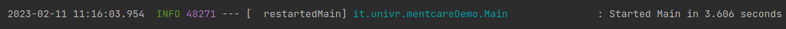

3) Una volta avviata correttamente l'applicazione, aprire manualmente il browser e collegarsi a "localhost:8080/h2console",
l'indirizzo che conduce alla console con cui è possibile impostare il database dell'applicazione.

- **Per poter operare su tale console è necessario che l'applicazione sia avviata.**
- **La console del database è diversa dalla console di esecuzione del programma.**

La console del database si presenta all'utente nel seguente modo:

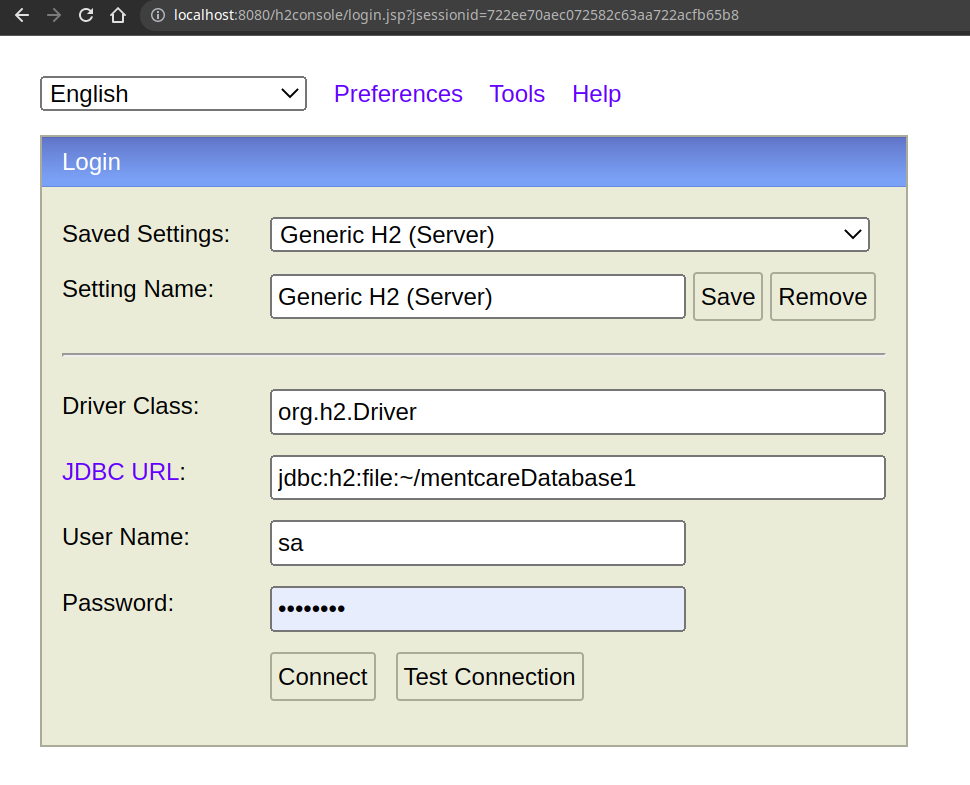

4) Effettuare il login inserendo le credenziali settate nel file "application.properties" e modificando la voce "JDBC URL" con la stringa scelta al posto di "mentcareDatabase1"

Una volta effettuato il login compare la schermata:

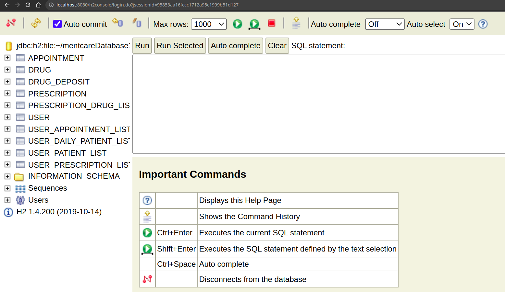

Sulla sinistra dell'interfaccia sono presenti le tabelle create all'interno del database.
Ogni tabella è stata creata in modo automatico da SpringBoot all'avvio del sistema.

Il database contiene le informazioni di tutti gli attori all'interno di una singola tabella USER.

5) Cliccare su USER tra le tabelle a sinistra e premere "Run" per eseguire il comando SQL.
6) Se il database è vuoto non compaiono utenti. **Per eseguire il primo avvio del sistema con database vuoto è necessario
create un Manager** poiché il manager è l'entità principale del sistema attraverso la quale è possibile creare tutti gli 
altri utenti del sistema.

Consiglio per la creazione un esempio d'inserimento dati di questo tipo:

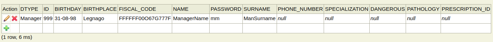

Si noti l'id volutamente posto a un valore alto, poiché SpringBoot registra valori progressivi degli id per com'è stato configurato.
Non si consiglia di utilizzare un id sotto il 10 poiché entrerebbe in conflitto con i prossimi passaggi, generando un errore.

7) Il manager è la figura principale da cui si può partire a testare l'applicazione. Senza riavviare tutto, collegarsi all'indirizzo "localhost:8080", dove si presenta questa schermata di login

8) Effettuare il login dell'utente manager creato utilizzando le credenziali inserite nel database, ovvero nel nostro caso l'id "999" e la password "mm"

9) Una volta entrati all'interno della home page del manager, è possibile creare le altre tipologie di utenti utilizzando l'interfaccia grafica
è possibile effettuare la creazione degli altri utenti allo stesso modo di come è stato creato il manager, tuttavia è sconsigliato.

10) L'applicazione permette l'utilizzo di differenti home page per differenti tipologie di utente, per cui una volta creati bisogna effettuare il logout da quella del manager per poter rieffettuare il login come utente di tipologia differente!

ATTENZIONE!
Una volta che l'applicazione è state avviata e il database popolato al fine di eseguire la fase di test è necessario
che all'interno del database NON siano presenti entità manager, dunque è necessario cancellare queste dalla console h2,
non è necessario cancellare gli utenti delle altre tipologie, ma consigliato; 
in alternativa utilizzare un nuovo database modificandone il nome.

### 5.4.2 - Guida all'esecuzione dei test

In questa sezione viene presentata la guida all'esecuzione dei test.
Prima di effettuare i test si consiglia la lettura della sezione 5.4.1.

Al fine di eseguire i test PageObject è necessario un database di partenza vuoto.

Per effettuare i test seguire i seguenti passi:

1) Aprire il file "application.properties" e scegliere il nome del file del database modificando la stringa
   "**mentcareDatabase1**" con un nuovo nome del database (esempio: "**testMentcareDatabase1**" )

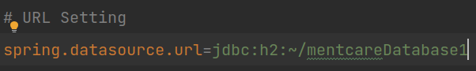

**Warning**: se i test sono eseguiti su un database utilizzato per l'esecuzione normale del sistema questi falliranno in quanto
i le entità presenti sul database andranno in conflitto con quelle creati per i test.

2) Avviare i test mandando in esecuzione tutte le classi del package "/src/test/java/it.univr.mentcareDemo"
Questa operazione avvierà l'esecuzione di 55 test.

**IMPORTANTE!**
- Non arrestare i test in corso d'opera in quanto vengono creati automaticamente utenti nel database ma non verrebbero rimossi.
- Non avviare i test quando nel database vi è almeno un manager creato.
- Si consiglia la lettura della sezione _5.4.1_ sopra per comprendere come eventualmente eliminare i manager.

### 5.4.3 - Elenco test di accettazione

### S1. Il medico effettua una nuova prescrizione

- TestM_CreateAndViewPrescription
> Il medico crea una nuova prescrizione per un paziente da lui in cura e verifico che i campi inseriti dal medico siano corretti.

### S2. Il medico visualizza la prescrizione di un paziente

- TestL_SearchPatientByDoctor
> Il medico inserisce nella barra di ricerca il cognome di un paziente e verifico che la tabella restituisce tutti gli appuntamenti
  con il paziente a lui associato.

- TestM_CreateAndViewPrescription
> Il medico visualizza la prescrizione di un paziente da lui in cura e verifico che i campi inseriti precedentemente siano corretti.

- TestR_CheckAppointmentByDoctor
> Il medico visualizza nella propria homepage i dati relativi a suoi appuntamenti e verifico che i campi inseriti dal receptionist
  siano corretti.

### S3. Un paziente visualizza la propria prescrizione medica

- TestP_ViewPrescriptionByPatient
> Il paziente visualizza la propria prescrizione medica e verifico che i campi inseriti dal medico
  siano corretti.

- TestQ_CheckAppointmentByPatient
> Il paziente visualizza nella propria homepage i dati relativi a suoi appuntamenti e verifico che i campi inseriti dal receptionist
  siano corretti.

### S4. Un infermiere deve somministrare un farmaco a un paziente

- TestN_SearchAppointmentByNurse
> Il medico inserisce nella barra di ricerca il cognome di un paziente e verifico che la tabella restituisce tutti gli appuntamenti
  con il paziente a lui associato.

- TestO_ViewPrescriptionByNurse
> L'infermiere visualizza la prescrizione del paziente a lui associato e verifico che i campi inseriti dal medico
  siano corretti.

- TestR_CheckAppointmentByNurse
> L'infermiere visualizza nella propria homepage i dati relativi a suoi appuntamenti e verifico che i campi inseriti dal receptionist
  siano corretti.

### S5. Il receptionist crea un nuovo appuntamento

- TestG_CreateAppointmentByReceptionist
> Il receptionist crea l'appuntamento relativo ad un preciso paziente e verifico che i campi inseriti sono corretti

### S6. Il receptionist modifica un appuntamento

- TestH_UpdateAppointmentByReceptionist
> Il receptionist modifica un appuntamento presente nel sistema e verifico che le modifiche sono state effettuate correttamente
  verificando i relativi campi.

### S7. Il receptionist cancella un appuntamento

- TestI_SearchAppointmentByReceptionist
> Il receptionist inserisce nella barra di ricerca il cognome di un paziente e verifico che la tabella restituisce tutti gli appuntamenti
  relativi a quel paziente

- TestT_DeleteAppointment
> Il receptionist cancella un appuntamento precedentemente creato e verifico che sia stato cancellato correttamente.

### S8. Il manager inserisce un nuovo utente nel sistema

- TestA_loginManager
> Il manager effettua il login alla propria homepage e verifico che si trova nella pagina desiderata.

- TestB_AddDoctor
> Il manager registra un nuovo dottore e una volta fatto verifico che i campi inseriti sono corretti.

- TestC_AddPatient
> Il manager registra un nuovo paziente e una volta fatto verifico che i campi inseriti sono corretti.

- TestD_AddNurse
> Il manager registra un nuovo infermiere e una volta fatto verifico che i campi inseriti sono corretti.

- TestE_AddReceptionist
> Il manager registra un nuovo receptionist e una volta fatto verifico che i campi inseriti sono corretti.

### S9. Il manager ricerca un utente nel sistema

- TestF_SearchUserByManager
> Il manager effettua la ricerca di un utente per cognome nella propria homepage e verifico che nella tabella della homepage
  compaiono solo gli utenti con il cognome inserito nel campo di ricerca.

## Test Coverage 

### Total Coverage:
Class: 92% (48/52)	
Method: 92% (238/256)
Line: 85% (714/832)

### System Test (Page Object)
Class: 100% (14/14)
Method: 97% (68/70)
Line: 85% (388/456)

### Unit Test (JUnit)
Class: 88% (32/36)
Method: 92% (170/184)
Line: 87% (324/372)